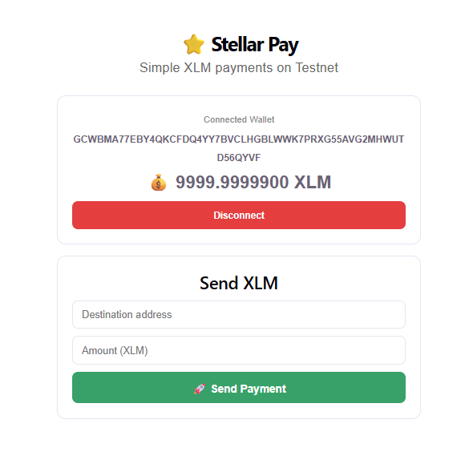
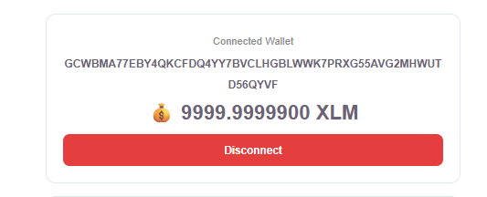
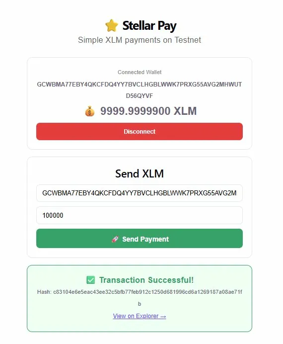

# ✨ Stellar Pay – Simple XLM Transfer dApp

A sleek and beginner-friendly decentralized application (dApp) built on the **Stellar Testnet** that allows users to connect their wallet, view balance, and send XLM seamlessly.

---

## 🚀 Features

* 🔗 Connect Freighter Wallet
* 💰 View real-time XLM balance
* 💸 Send XLM to any Stellar address
* ✅ Transaction success & error feedback
* 🔍 View transaction on Stellar Explorer
* 🎨 Modern glassmorphism UI

---

## 🛠️ Tech Stack

* **Frontend:** React (Vite)
* **Blockchain:** Stellar Testnet
* **Wallet:** Freighter Wallet
* **SDK:** Stellar JavaScript SDK

---

## ⚙️ How to Run Locally

```bash
# Clone the repo
git clone https://github.com/YOUR_USERNAME/stellar-pay.git

# Go into project
cd stellar-pay

# Install dependencies
npm install

# Run the app
npm run dev
```

---

## 🔑 Setup Requirements

1. Install **Freighter Wallet** (Chrome Extension)
2. Switch to **Testnet**
3. Fund your wallet using Stellar Faucet:
   👉 https://laboratory.stellar.org/#account-creator

---

## 📸 Screenshots

### 🔗 Wallet Connected


### 💰 Balance Display


### 🚀 Successful Transaction


---

## 🌐 How It Works

1. User connects their Freighter wallet
2. App fetches and displays XLM balance
3. User enters destination + amount
4. Transaction is signed via wallet
5. Transaction is submitted to Stellar Testnet
6. Result (success/failure + hash) is displayed

---

## 🎯 Project Goal

This project was built as part of the **Stellar Journey to Mastery – White Belt Level**, focusing on:

* Wallet integration
* Balance handling
* Transaction execution
* Real dApp deployment

---

## 📌 Future Improvements

* 🧾 Transaction history
* 📱 Mobile responsiveness
* 🌍 Mainnet support
* 🔐 Smart contract integration

---

## 👩‍💻 Author

**Ananya**
AI & ML Enthusiast | Developer 🚀

---

## ⭐ Acknowledgment

Built using the Stellar ecosystem and inspired by the **Stellar Builder Program**.

---

## ⚡ Final Note

This is a testnet-based application.
No real funds are used or transferred.

---
